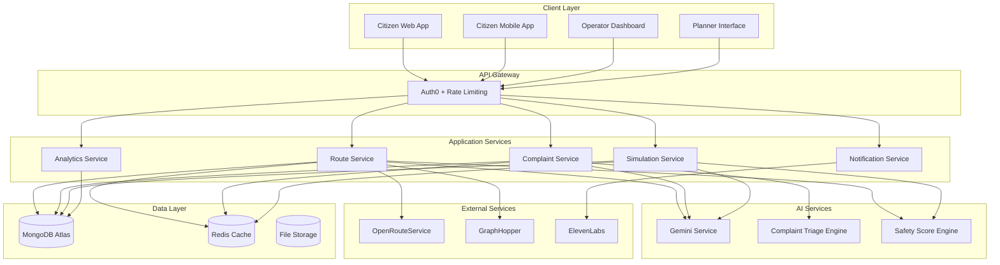
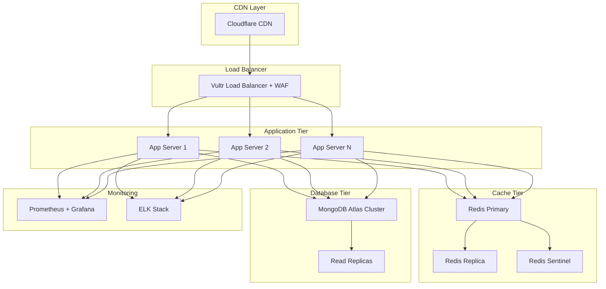

# CivicSafe AI Design Document

## Overview

CivicSafe AI is a comprehensive smart city safety platform that integrates intelligent routing, AI-powered complaint management, and safety simulation tools into a unified ecosystem. The system serves three distinct user personas through specialized interfaces while maintaining a shared data foundation and AI-powered insights engine.

### Core Value Proposition

The platform transforms how cities approach safety by combining real-time crowdsourced data, historical incident analysis, and AI-powered decision support. Citizens receive personalized safety guidance, operators gain intelligent triage capabilities, and planners access predictive simulation tools for evidence-based infrastructure decisions.

### System Boundaries

**In Scope:**
- Multi-tenant web and mobile applications for three user types
- AI-powered route calculation with safety scoring
- Intelligent complaint classification and triage
- Safety impact simulation and what-if analysis
- Real-time data processing and visualization
- Integration with external routing and AI services

**Out of Scope:**
- Emergency dispatch system integration
- Direct law enforcement coordination
- Physical infrastructure monitoring sensors
- Payment processing for city services
- Multi-language localization (English only for MVP)

## Architecture

### High-Level Architecture

The system follows a microservices architecture with clear separation between user-facing applications, business logic services, and data management layers. This design supports independent scaling, deployment, and maintenance of different system components.



### Technology Stack

**Frontend Technologies:**
- React 18 with TypeScript for web applications
- React Native for mobile applications
- Mapbox GL JS for interactive mapping
- Material-UI for consistent design system
- PWA capabilities for offline functionality

**Backend Technologies:**
- Node.js 18+ with Express.js framework
- TypeScript for type safety
- JWT tokens for stateless authentication
- WebSocket connections for real-time updates
- Docker containers for deployment

**Data Storage:**
- MongoDB Atlas for primary data storage
- Redis for caching and session management
- GridFS for file storage (images, audio)
- Geospatial indexing for location queries

**External Integrations:**
- Auth0 for authentication and user management
- Gemini AI for natural language processing
- OpenRouteService/GraphHopper for routing with fallback strategy
- ElevenLabs for voice synthesis (optional)
- Vultr for cloud infrastructure
- Mapbox for enhanced mapping and geocoding services

**API Design Improvements:**
- **Rate Limiting:** Tiered limits (1000/hour citizens, 5000/hour operators, unlimited planners)
- **Response Compression:** Gzip compression for responses >1KB
- **API Versioning:** Semantic versioning with backward compatibility for 2 major versions
- **Bulk Operations:** Batch endpoints for complaint updates and route calculations
- **Webhook Reliability:** Retry mechanism with exponential backoff for failed webhook deliveries

### Deployment Architecture

The system deploys on Vultr cloud infrastructure using containerized microservices with horizontal scaling capabilities and enhanced load balancing.



**Scalability Improvements:**
- **Auto-scaling:** Kubernetes HPA based on CPU/memory and custom metrics (route requests/minute)
- **Database Optimization:** Read replicas for analytics queries, connection pooling with max 100 connections per service
- **CDN Integration:** Cloudflare for static assets and API response caching
- **Health Checks:** Comprehensive health endpoints with dependency status
- **Blue-Green Deployment:** Zero-downtime deployments with automated rollback on failure

## Components and Interfaces

### Safe Router Service

The Safe Router Service calculates optimal routes by combining external routing APIs with internal safety scoring algorithms.

**Core Responsibilities:**
- Route calculation using external APIs with intelligent fallback
- Safety score computation and caching with spatial optimization
- Route profile generation with real-time updates
- Performance monitoring and adaptive routing

**Enhanced Routing Strategy:**
- **Primary/Fallback APIs:** OpenRouteService primary, GraphHopper fallback, Mapbox emergency fallback
- **Response Time Optimization:** Parallel API calls with first-response wins for time-critical requests
- **Intelligent Caching:** Cache popular routes for 15 minutes, extend to 1 hour for rural areas
- **Route Validation:** Verify route feasibility and safety before returning to users

**Key Interfaces:**

```typescript
interface RouteRequest {
  origin: GeoPoint;
  destination: GeoPoint;
  preferences: RoutePreferences;
  userId?: string;
}

interface RouteResponse {
  routes: Route[];
  explanations: RouteExplanation[];
  calculationTime: number;
}

interface Route {
  id: string;
  segments: RouteSegment[];
  totalDistance: number;
  estimatedTime: number;
  safetyScore: number;
  routeType: 'fastest' | 'safest';
}

interface RouteSegment {
  coordinates: GeoPoint[];
  safetyScore: number;
  safetyFactors: SafetyFactor[];
  distance: number;
  estimatedTime: number;
}
```

**Safety Scoring Algorithm:**

The safety scoring combines multiple data sources with weighted factors and implements intelligent caching for performance:

1. **Historical Incidents (40% weight):** Crime reports, accidents, emergency calls
2. **Infrastructure Quality (25% weight):** Lighting, sidewalks, crosswalks
3. **Crowdsourced Reports (20% weight):** Recent user safety reports
4. **Environmental Factors (15% weight):** Time of day, weather, events

**Performance Optimizations:**
- **Spatial Indexing:** MongoDB 2dsphere indexes for sub-100ms geospatial queries
- **Score Caching:** Redis-based caching with 5-minute TTL for frequently requested segments
- **Batch Processing:** Aggregate safety score updates every 2 minutes instead of real-time
- **Precomputed Grids:** 100m x 100m safety score grid cached for major city areas
- **Incremental Updates:** Only recalculate affected segments when new data arrives

### Complaint Triage Engine

The Complaint Triage Engine uses AI to automatically classify and prioritize citizen complaints for efficient operator response.

**Core Responsibilities:**
- Natural language processing of complaint text with context awareness
- Automatic classification into predefined categories with confidence scoring
- Urgency level assignment based on content and location factors
- Confidence scoring for manual review flagging with audit trail

**Enhanced AI Processing:**
- **Multi-Model Approach:** Primary Gemini AI with OpenAI GPT-4 fallback for high-confidence classification
- **Context Enrichment:** Incorporate historical complaint patterns, local events, and weather data
- **Bias Detection:** Monitor classification patterns for demographic or geographic bias
- **Continuous Learning:** Weekly model retraining with operator feedback integration
- **Explainable AI:** Detailed reasoning chains for all classification decisions

**Key Interfaces:**

```typescript
interface ComplaintSubmission {
  text: string;
  location: GeoPoint;
  photos?: string[];
  audioNote?: string;
  submitterId: string;
  timestamp: Date;
}

interface TriageResult {
  complaintId: string;
  category: ComplaintCategory;
  urgencyLevel: UrgencyLevel;
  confidence: number;
  reasoning: string;
  suggestedDepartment: string;
  estimatedResponseTime: number;
}

enum ComplaintCategory {
  LIGHTING = 'lighting',
  INFRASTRUCTURE = 'infrastructure',
  TRAFFIC = 'traffic',
  CRIME = 'crime',
  MAINTENANCE = 'maintenance',
  OTHER = 'other'
}

enum UrgencyLevel {
  LOW = 'low',
  MEDIUM = 'medium',
  HIGH = 'high',
  CRITICAL = 'critical'
}
```

**Classification Algorithm:**

The AI classification process follows these steps:

1. **Text Preprocessing:** Clean and normalize complaint text
2. **Feature Extraction:** Extract keywords, sentiment, and context
3. **Location Context:** Consider area-specific factors and history
4. **Category Classification:** Use trained model for category assignment
5. **Urgency Assessment:** Evaluate severity based on content and location
6. **Confidence Scoring:** Calculate reliability of classification

### Safety Simulator

The Safety Simulator provides urban planners with tools to model the safety impact of infrastructure changes.

**Core Responsibilities:**
- Infrastructure scenario modeling
- Safety impact prediction
- Cost-benefit analysis
- Comparative scenario evaluation

**Key Interfaces:**

```typescript
interface SimulationScenario {
  id: string;
  name: string;
  description: string;
  infrastructureChanges: InfrastructureChange[];
  baselineDate: Date;
  createdBy: string;
}

interface InfrastructureChange {
  type: InfrastructureType;
  location: GeoPoint | GeoArea;
  action: 'add' | 'remove' | 'modify';
  specifications: Record<string, any>;
  estimatedCost: number;
}

interface SimulationResult {
  scenarioId: string;
  safetyImpact: SafetyImpactMetrics;
  costAnalysis: CostAnalysis;
  riskAssessment: RiskAssessment;
  recommendations: string[];
}

interface SafetyImpactMetrics {
  overallSafetyChange: number;
  affectedAreas: GeoArea[];
  predictedComplaintChange: number;
  incidentReductionEstimate: number;
}
```

**User Interface Components**

**Citizen Mobile App:**
- Interactive map with route visualization and offline capability
- Quick safety reporting interface with voice-to-text support
- Complaint submission with media upload and compression
- Progressive Web App (PWA) for cross-platform compatibility
- Voice navigation and comprehensive accessibility support
- Battery optimization with intelligent background sync

**Operator Dashboard:**
- Real-time complaint management interface with live updates
- Advanced safety heatmap visualization with temporal controls
- AI triage results with explainable confidence indicators
- Workflow automation tools and bulk operation support
- Customizable dashboard layouts and alert preferences
- Mobile-responsive design for field operations

**Planner Interface:**
- Advanced infrastructure simulation workspace with 3D visualization
- Multi-scenario comparison tools with statistical analysis
- Cost-benefit analysis dashboards with ROI calculations
- Collaborative planning features with version control
- Export capabilities for presentations and reports
- Integration with GIS systems and CAD tools

**Enhanced Security Measures:**

**Authentication & Authorization:**
- **Multi-Factor Authentication:** Required for operator and planner accounts
- **Session Management:** JWT tokens with refresh token rotation and device fingerprinting
- **Role-Based Access Control:** Granular permissions with principle of least privilege
- **API Security:** OAuth 2.0 with PKCE for mobile apps, API key management for integrations
- **Audit Logging:** Comprehensive activity logs with tamper-proof storage

**Data Protection:**
- **Encryption at Rest:** AES-256 encryption for all sensitive data with key rotation
- **Encryption in Transit:** TLS 1.3 for all communications with certificate pinning
- **Data Anonymization:** Advanced k-anonymity techniques for crowdsourced data
- **PII Protection:** Automatic detection and masking of personally identifiable information
- **Secure File Storage:** Encrypted file storage with virus scanning and content validation

**Application Security:**
- **Input Validation:** Comprehensive sanitization and validation for all user inputs
- **SQL Injection Prevention:** Parameterized queries and ORM-level protection
- **XSS Protection:** Content Security Policy (CSP) and output encoding
- **CSRF Protection:** Double-submit cookies and SameSite cookie attributes
- **Rate Limiting:** Adaptive rate limiting with IP reputation scoring

**Infrastructure Security:**
- **Network Security:** VPC isolation, security groups, and network ACLs
- **Container Security:** Image scanning, runtime protection, and least-privilege containers
- **Secrets Management:** HashiCorp Vault for API keys and database credentials
- **Monitoring & Detection:** SIEM integration with anomaly detection and threat intelligence
- **Incident Response:** Automated security incident response with forensic capabilities

## Data Models

### Core Entity Models

**User Model:**
```typescript
interface User {
  id: string;
  auth0Id: string;
  email: string;
  role: UserRole;
  profile: UserProfile;
  preferences: UserPreferences;
  createdAt: Date;
  lastActive: Date;
  isActive: boolean;
}

enum UserRole {
  CITIZEN = 'citizen',
  OPERATOR = 'operator',
  PLANNER = 'planner',
  ADMIN = 'admin'
}

interface UserProfile {
  firstName?: string;
  lastName?: string;
  department?: string; // For operators and planners
  phoneNumber?: string;
  accessibilityNeeds?: AccessibilityOptions[];
}
```

**Safety Segment Model:**
```typescript
interface SafetySegment {
  id: string;
  geometry: GeoLineString;
  safetyScore: number;
  lastUpdated: Date;
  factors: SafetyFactor[];
  historicalData: HistoricalSafetyData[];
  crowdsourcedReports: string[]; // References to reports
}

interface SafetyFactor {
  type: SafetyFactorType;
  value: number;
  weight: number;
  source: DataSource;
  lastUpdated: Date;
}

enum SafetyFactorType {
  LIGHTING = 'lighting',
  FOOT_TRAFFIC = 'foot_traffic',
  CRIME_HISTORY = 'crime_history',
  INFRASTRUCTURE = 'infrastructure',
  EMERGENCY_ACCESS = 'emergency_access'
}
```

**Complaint Model:**
```typescript
interface Complaint {
  id: string;
  submitterId: string;
  text: string;
  location: GeoPoint;
  address: string;
  category: ComplaintCategory;
  urgencyLevel: UrgencyLevel;
  status: ComplaintStatus;
  assignedDepartment?: string;
  assignedOperator?: string;
  aiClassification: AIClassificationResult;
  attachments: Attachment[];
  timeline: ComplaintTimelineEntry[];
  createdAt: Date;
  updatedAt: Date;
}

interface AIClassificationResult {
  category: ComplaintCategory;
  urgencyLevel: UrgencyLevel;
  confidence: number;
  reasoning: string;
  suggestedDepartment: string;
  processingTime: number;
}

enum ComplaintStatus {
  SUBMITTED = 'submitted',
  TRIAGED = 'triaged',
  ASSIGNED = 'assigned',
  IN_PROGRESS = 'in_progress',
  RESOLVED = 'resolved',
  CLOSED = 'closed'
}
```

**Route Model:**
```typescript
interface Route {
  id: string;
  userId?: string;
  origin: GeoPoint;
  destination: GeoPoint;
  segments: RouteSegment[];
  totalDistance: number;
  estimatedTime: number;
  safetyScore: number;
  routeType: RouteType;
  explanation: string;
  createdAt: Date;
  expiresAt: Date;
}

interface RouteSegment {
  id: string;
  coordinates: GeoPoint[];
  safetyScore: number;
  distance: number;
  estimatedTime: number;
  safetyFactors: SafetyFactor[];
  warnings: SafetyWarning[];
}

enum RouteType {
  FASTEST = 'fastest',
  SAFEST = 'safest',
  BALANCED = 'balanced'
}
```

### Geospatial Data Structures

**GeoPoint:**
```typescript
interface GeoPoint {
  type: 'Point';
  coordinates: [number, number]; // [longitude, latitude]
}
```

**GeoArea:**
```typescript
interface GeoArea {
  type: 'Polygon';
  coordinates: number[][][]; // GeoJSON polygon format
}
```

**GeoLineString:**
```typescript
interface GeoLineString {
  type: 'LineString';
  coordinates: number[][]; // Array of [longitude, latitude] pairs
}
```

### Database Indexing Strategy

**MongoDB Collections and Indexes:**

1. **users**: Compound index on (auth0Id, role), single index on email, TTL index on lastActive (90 days)
2. **complaints**: Geospatial 2dsphere index on location, compound index on (status, urgencyLevel, createdAt), text index on complaint text
3. **safetySegments**: Geospatial 2dsphere index on geometry, compound index on (lastUpdated, safetyScore), spatial hash index for grid queries
4. **routes**: TTL index on expiresAt, compound index on (userId, createdAt), geospatial index on origin/destination
5. **reports**: Geospatial 2dsphere index on location, compound index on (submitterId, createdAt), sparse index on verificationStatus

**Enhanced Cache Strategy:**
- **Route calculations:** Cached for 15 minutes (urban), 1 hour (rural), with LRU eviction
- **Safety scores:** Cached for 5 minutes with write-through updates
- **User sessions:** Cached for 8 hours with sliding expiration
- **Static data:** Infrastructure cached for 24 hours, complaint categories for 1 week
- **Geospatial queries:** Spatial query results cached for 10 minutes with geographic partitioning

**Database Optimization:**
- **Connection Pooling:** Max 100 connections per service with connection recycling
- **Read Preferences:** Analytics queries routed to read replicas
- **Write Concerns:** Majority write concern for critical data, acknowledged for logs
- **Sharding Strategy:** Geographic sharding by city/region for horizontal scaling

## Correctness Properties

*A property is a characteristic or behavior that should hold true across all valid executions of a system-essentially, a formal statement about what the system should do. Properties serve as the bridge between human-readable specifications and machine-verifiable correctness guarantees.*

### Property 1: Route Generation Completeness

*For any* valid origin and destination coordinates, the Safe_Router should generate both fastest and safest route options, with each route containing properly scored segments and appropriate color coding based on safety levels.

**Validates: Requirements 1.1, 1.2, 1.3, 1.4**

### Property 2: Route Explanation Generation

*For any* generated route, the Gemini_AI should produce explanations that reference specific safety factors and include appropriate warnings for routes passing through lower safety areas.

**Validates: Requirements 2.1, 2.2, 2.3**

### Property 3: Safety Report Data Capture

*For any* safety report submission, the system should automatically capture location data and support attachment of photos and voice notes while validating report authenticity.

**Validates: Requirements 3.2, 3.3, 3.5**

### Property 4: Complaint Data Completeness

*For any* complaint submission, the system should capture all required fields (text, location, photos, timestamp) and return a confirmation with tracking number.

**Validates: Requirements 4.1, 4.5**

### Property 5: Complaint Classification Validity

*For any* complaint processed by the triage engine, the system should assign valid urgency levels with confidence scores in the range 0-100, and flag critical safety complaints appropriately.

**Validates: Requirements 4.3, 4.4, 5.3, 5.4**

### Property 6: NLP Processing Consistency

*For any* complaint text, the triage engine should process it through natural language processing and incorporate location-specific factors in classification decisions.

**Validates: Requirements 5.1, 5.2**

### Property 7: Priority Update Propagation

*For any* complaint with new information, the triage engine should re-evaluate and update priorities as context changes.

**Validates: Requirements 5.5**

### Property 8: Complaint Display Ordering

*For any* set of active complaints, the operator dashboard should display them correctly sorted by urgency level and creation time.

**Validates: Requirements 6.1**

### Property 9: Complaint Detail Completeness

*For any* complaint viewed by an operator, the system should display all required information including details, map location, and AI classification reasoning.

**Validates: Requirements 6.2**

### Property 10: Operator Update Functionality

*For any* complaint, operators should be able to update status, assign to departments, and add response notes with changes properly persisted.

**Validates: Requirements 6.3**

### Property 11: Heatmap Data Accuracy

*For any* generated safety heatmap, the visualization should correctly represent complaint density and safety scores across city areas, highlighting hotspots when patterns emerge.

**Validates: Requirements 6.4, 6.5**

### Property 12: Daily Summary Content Completeness

*For any* daily safety summary, the AI should include analysis of complaint trends, safety score changes, correlations with external factors, actionable recommendations, and highlight critical issues when present.

**Validates: Requirements 7.1, 7.2, 7.3, 7.5**

### Property 13: Simulation Response to Changes

*For any* infrastructure modification in the safety simulator, the system should recalculate safety scores for affected areas, predict complaint volume changes, and generate before/after comparison data.

**Validates: Requirements 8.3, 8.4, 8.5**

### Property 14: Scenario Management Functionality

*For any* infrastructure scenario, planners should be able to save it with a name, compare multiple scenarios with safety and cost metrics, rank scenarios by cost-effectiveness, export comparisons, and validate feasibility.

**Validates: Requirements 9.1, 9.2, 9.3, 9.4, 9.5**

### Property 15: Authentication and Authorization

*For any* user authentication attempt, the system should accept valid Auth0 credentials, enforce role-based permissions, and redirect unauthorized access attempts appropriately while logging actions with PII protection.

**Validates: Requirements 10.1, 10.2, 10.3, 10.5**

### Property 16: Critical Incident Notification

*For any* safety report classified as critical, the system should immediately trigger notifications to relevant operators.

**Validates: Requirements 11.3**

### Property 17: API Data Export Functionality

*For any* complaint data export request, the REST API should return data in the expected format for integration with city management systems.

**Validates: Requirements 12.1**

### Property 18: External Data Validation

*For any* external data source integration, the system should validate data quality and flag inconsistencies appropriately.

**Validates: Requirements 12.3**

### Property 19: Webhook Event Triggering

*For any* appropriate system event, webhook notifications should be triggered for real-time data sharing with partner systems.

**Validates: Requirements 12.4**

### Property 20: API Rate Limiting

*For any* API request sequence, rate limiting should be enforced to prevent system overload while maintaining responsive service.

**Validates: Requirements 12.5**

### Property 21: Offline Functionality

*For any* basic route viewing and complaint drafting operation, the system should function without network connectivity and synchronize actions when connectivity is restored.

**Validates: Requirements 13.2, 13.3**

### Property 22: Data Encryption and Anonymization

*For any* user location data, the system should encrypt it using AES-256 both in transit and at rest, and anonymize crowdsourced reports while preserving location accuracy.

**Validates: Requirements 14.1, 14.2**

### Property 23: User Data Control

*For any* user account, the system should provide functional data export and deletion controls through account settings.

**Validates: Requirements 14.5**

### Property 24: Accessibility Feature Availability

*For any* user interface, the system should support screen readers, provide high contrast mode and adjustable fonts, offer voice-to-text input, and include audio guidance with safety warnings.

**Validates: Requirements 15.1, 15.2, 15.3, 15.4**

## Error Handling

### Error Classification and Response Strategy

The system implements a comprehensive error handling strategy that categorizes errors by severity and provides appropriate user feedback while maintaining system stability.

**Error Categories:**

1. **User Input Errors (4xx level)**
   - Invalid coordinates or addresses
   - Malformed complaint submissions
   - Authentication failures
   - Rate limit violations

2. **System Errors (5xx level)**
   - External API failures (routing services, Gemini AI)
   - Database connectivity issues
   - Cache service unavailability
   - File storage problems

3. **Business Logic Errors**
   - Safety score calculation failures
   - Route generation timeouts
   - Classification confidence below thresholds
   - Simulation constraint violations

**Enhanced Error Response Patterns:**

```typescript
interface ErrorResponse {
  error: {
    code: string;
    message: string;
    details?: Record<string, any>;
    timestamp: Date;
    requestId: string;
    retryAfter?: number; // For rate limiting
    fallbackAvailable?: boolean;
  };
  fallback?: any; // Graceful degradation data
  userGuidance?: string; // User-friendly action suggestions
}
```

**Improved Graceful Degradation Strategies:**

- **Route Calculation Failures:** 
  - Primary: Fall back to cached routes within 24 hours
  - Secondary: Use basic distance-based routing with safety warnings
  - Tertiary: Provide walking directions with manual safety reminders
- **AI Service Unavailability:** 
  - Use rule-based classification with confidence penalties
  - Queue requests for batch processing when service returns
  - Escalate all uncertain classifications to manual review
- **Database Connectivity Issues:** 
  - Serve cached data with clear staleness indicators
  - Enable read-only mode for critical safety information
  - Implement write-behind caching for complaint submissions
- **External API Failures:** 
  - Automatic failover between OpenRouteService, GraphHopper, and Mapbox
  - Use cached route templates for common city routes
  - Provide offline maps for basic navigation

**Enhanced Error Monitoring and Alerting:**

- **Real-time Monitoring:** Prometheus metrics with custom dashboards for safety-critical operations
- **Intelligent Alerting:** Machine learning-based anomaly detection for unusual error patterns
- **User Impact Tracking:** Monitor user abandonment rates during error conditions
- **Automated Recovery:** Self-healing mechanisms for common failure scenarios
- **Incident Response:** Automated escalation procedures for safety-critical system failures

### Advanced Retry and Circuit Breaker Patterns

**Intelligent Retry Strategies:**
- **External API calls:** Jittered exponential backoff with per-service retry budgets
- **Database operations:** Linear backoff with connection pool awareness
- **File uploads:** Progressive retry with size-based timeout adjustments
- **AI processing:** Queue-based retry with priority handling for critical complaints

**Enhanced Circuit Breaker Implementation:**
- **Adaptive Thresholds:** Dynamic failure rate thresholds based on historical performance
- **Service Health Scoring:** Composite health metrics including latency, error rate, and throughput
- **Graceful Degradation Triggers:** Proactive fallback activation before complete service failure
- **Recovery Validation:** Health check verification before circuit breaker reset

**Fallback Service Orchestration:**
```typescript
interface ServiceFallbackChain {
  primary: ServiceConfig;
  fallbacks: ServiceConfig[];
  healthCheck: HealthCheckConfig;
  failoverCriteria: FailoverCriteria;
  recoveryStrategy: RecoveryStrategy;
}
```

## Testing Strategy

### Dual Testing Approach

The CivicSafe AI platform employs a comprehensive testing strategy that combines unit testing for specific scenarios with property-based testing for universal correctness guarantees.

**Unit Testing Focus Areas:**
- Specific user interaction flows and edge cases
- Integration points between services
- Error conditions and boundary cases
- Authentication and authorization workflows
- API endpoint functionality with mock data

**Property-Based Testing Focus Areas:**
- Universal properties that must hold across all inputs
- Data transformation and validation logic
- Safety scoring algorithms with randomized inputs
- Route calculation correctness across coordinate ranges
- Complaint classification accuracy with varied text inputs

### Property-Based Testing Configuration

**Testing Framework:** fast-check for JavaScript/TypeScript property-based testing

**Test Configuration Requirements:**
- Minimum 100 iterations per property test to ensure comprehensive input coverage
- Each property test must reference its corresponding design document property
- Tag format: **Feature: civic-safe-ai, Property {number}: {property_text}**
- Randomized test data generators for coordinates, complaint text, user profiles, and infrastructure scenarios

**Example Property Test Structure:**

```typescript
// Feature: civic-safe-ai, Property 1: Route Generation Completeness
test('Route generation produces both fastest and safest options', () => {
  fc.assert(fc.property(
    fc.record({
      origin: coordinateGenerator,
      destination: coordinateGenerator
    }),
    async (routeRequest) => {
      const result = await routeService.calculateRoutes(routeRequest);
      
      expect(result.routes).toHaveLength(2);
      expect(result.routes.some(r => r.routeType === 'fastest')).toBe(true);
      expect(result.routes.some(r => r.routeType === 'safest')).toBe(true);
      
      result.routes.forEach(route => {
        expect(route.segments.every(s => 
          s.safetyScore >= 0 && s.safetyScore <= 100
        )).toBe(true);
      });
    }
  ), { numRuns: 100 });
});
```

**Data Generators:**

```typescript
const coordinateGenerator = fc.record({
  latitude: fc.float({ min: -90, max: 90 }),
  longitude: fc.float({ min: -180, max: 180 })
});

const complaintTextGenerator = fc.string({ 
  minLength: 10, 
  maxLength: 500 
});

const userRoleGenerator = fc.constantFrom(
  'citizen', 'operator', 'planner', 'admin'
);
```

### Enhanced Integration Testing Strategy

**Service Integration Tests:**
- **End-to-end Workflows:** Complete user journeys from route request to complaint resolution
- **Cross-Service Communication:** Message passing, event handling, and data consistency
- **External Service Integration:** Real API testing with sandbox environments
- **Performance Under Load:** Concurrent user simulation with realistic data volumes
- **Failure Scenario Testing:** Chaos engineering with controlled service disruptions

**Advanced External Service Mocking:**
- **Intelligent Mocks:** AI-powered response generation based on request patterns
- **Latency Simulation:** Network delay and jitter simulation for realistic testing
- **Failure Injection:** Controlled failure scenarios with recovery validation
- **Data Consistency:** Mock data synchronization across test environments
- **Version Compatibility:** Testing against multiple API versions simultaneously

**Comprehensive Performance Testing:**
- **Load Testing:** Gradual ramp-up to 10,000 concurrent users with realistic usage patterns
- **Stress Testing:** Beyond-capacity testing to identify breaking points
- **Spike Testing:** Sudden traffic surge simulation (emergency scenarios)
- **Volume Testing:** Large dataset processing with millions of safety reports
- **Endurance Testing:** 24-hour continuous operation validation

**Real-Time System Testing:**
- **WebSocket Connection Testing:** Connection stability under various network conditions
- **Event Processing:** Real-time notification delivery and ordering guarantees
- **Data Synchronization:** Multi-user concurrent editing and conflict resolution
- **Geographic Distribution:** Testing across multiple regions and time zones

### Enhanced Accessibility Testing

**Automated Accessibility Testing:**
- **Multi-Tool Validation:** axe-core, WAVE, and Lighthouse accessibility audits
- **Screen Reader Compatibility:** NVDA, JAWS, and VoiceOver testing automation
- **Keyboard Navigation:** Comprehensive tab order and focus management validation
- **Color Contrast:** WCAG AAA compliance verification with color blindness simulation
- **Cognitive Load Testing:** Reading level analysis and cognitive accessibility metrics

**Manual Accessibility Testing:**
- **User Testing with Disabilities:** Regular testing sessions with diverse user groups
- **Assistive Technology Validation:** Real-world testing with various assistive devices
- **Voice Navigation Workflows:** Complete task completion using voice commands only
- **Motor Accessibility:** Testing with limited mobility simulation tools
- **Sensory Accessibility:** Audio description and haptic feedback validation

**Inclusive Design Validation:**
- **Multi-Language Support:** Unicode handling and RTL language compatibility
- **Cultural Sensitivity:** Content and imagery review for cultural appropriateness
- **Socioeconomic Accessibility:** Low-bandwidth and older device compatibility
- **Digital Literacy:** Interface complexity analysis and simplification recommendations

### Enhanced Security Testing

**Authentication and Authorization Testing:**
- **Multi-Factor Authentication:** TOTP, SMS, and biometric authentication flows
- **Role-Based Access Control:** Comprehensive permission matrix validation
- **JWT Security:** Token manipulation, expiration, and refresh token security
- **Session Management:** Concurrent session limits and secure logout validation
- **API Security:** OAuth 2.0 flow testing and API key management validation

**Advanced Data Protection Testing:**
- **Encryption Validation:** End-to-end encryption verification for all data paths
- **PII Detection:** Automated scanning for personally identifiable information leaks
- **Data Anonymization:** K-anonymity and differential privacy validation
- **GDPR Compliance:** Data export, deletion, and consent management testing
- **Cross-Border Data Transfer:** Data residency and sovereignty compliance validation

**Penetration Testing:**
- **OWASP Top 10:** Comprehensive vulnerability assessment and remediation
- **API Security Testing:** GraphQL and REST API security validation
- **Infrastructure Security:** Network penetration testing and container security assessment
- **Social Engineering:** Phishing simulation and security awareness validation
- **Third-Party Security:** Vendor security assessment and supply chain validation

**Compliance and Audit Testing:**
- **SOC 2 Type II:** Security, availability, and confidentiality controls validation
- **ISO 27001:** Information security management system compliance
- **NIST Cybersecurity Framework:** Risk assessment and control implementation validation
- **Local Regulations:** City-specific data protection and privacy law compliance

### Enhanced Continuous Integration Pipeline

**Multi-Stage Automated Testing:**
- **Pre-commit Hooks:** Code quality, security scanning, and basic unit tests
- **Pull Request Validation:** Full test suite, security analysis, and performance benchmarks
- **Staging Deployment:** Integration tests, accessibility validation, and user acceptance testing
- **Production Deployment:** Canary releases with automated rollback triggers
- **Post-deployment Monitoring:** Real-time performance and error rate monitoring

**Advanced Quality Gates:**
- **Code Coverage:** 90% minimum with branch coverage analysis
- **Security Scanning:** Zero critical vulnerabilities, dependency vulnerability assessment
- **Performance Benchmarks:** Response time SLAs and resource utilization limits
- **Accessibility Compliance:** WCAG 2.1 AA compliance with automated and manual validation
- **Documentation Coverage:** API documentation completeness and accuracy validation

**Intelligent Test Environment Management:**
- **Dynamic Environment Provisioning:** On-demand test environments with realistic data
- **Test Data Management:** Synthetic data generation with privacy-preserving techniques
- **Environment Isolation:** Containerized test environments with network isolation
- **Parallel Test Execution:** Distributed testing across multiple environments
- **Test Result Analytics:** ML-powered test failure analysis and flaky test detection

**DevSecOps Integration:**
- **Security as Code:** Infrastructure security policies and compliance validation
- **Automated Vulnerability Management:** Continuous security scanning and remediation
- **Compliance Monitoring:** Real-time compliance status and audit trail generation
- **Incident Response Automation:** Automated security incident detection and response
- **Security Metrics Dashboard:** Security posture visualization and trend analysis

## Additional Technical Enhancements

### User Experience Optimizations

**Progressive Web App Features:**
- **Offline-First Design:** Service worker implementation for offline route viewing and complaint drafting
- **Background Sync:** Automatic synchronization when connectivity is restored
- **Push Notifications:** Real-time safety alerts and complaint status updates
- **App Shell Architecture:** Instant loading with cached application shell
- **Adaptive Loading:** Dynamic content loading based on network conditions

**Enhanced Accessibility:**
- **Voice Interface:** Complete voice navigation for hands-free operation
- **Haptic Feedback:** Tactile feedback for route guidance and safety warnings
- **High Contrast Themes:** Multiple color schemes for visual accessibility
- **Font Scaling:** Dynamic font size adjustment up to 200% without layout breaking
- **Cognitive Accessibility:** Simplified interfaces and clear navigation patterns

**Performance Optimizations:**
- **Image Optimization:** WebP format with fallbacks, lazy loading, and responsive images
- **Code Splitting:** Dynamic imports for feature-based code splitting
- **Bundle Optimization:** Tree shaking and dead code elimination
- **CDN Integration:** Global content delivery with edge caching
- **Resource Hints:** Preloading critical resources and prefetching likely next actions

### Monitoring and Observability

**Application Performance Monitoring:**
- **Real User Monitoring (RUM):** Client-side performance metrics and user experience tracking
- **Synthetic Monitoring:** Proactive monitoring with simulated user journeys
- **Core Web Vitals:** LCP, FID, and CLS monitoring with performance budgets
- **Error Tracking:** Comprehensive error monitoring with user context and stack traces
- **Business Metrics:** Route calculation success rates, complaint resolution times, user satisfaction scores

**Infrastructure Monitoring:**
- **Service Mesh Observability:** Istio-based traffic monitoring and distributed tracing
- **Container Monitoring:** Resource utilization, health checks, and auto-scaling metrics
- **Database Performance:** Query performance, connection pool utilization, and replication lag
- **Cache Effectiveness:** Hit rates, eviction patterns, and memory utilization
- **External Service Monitoring:** API response times, error rates, and availability tracking

**Security Monitoring:**
- **SIEM Integration:** Security event correlation and threat detection
- **Anomaly Detection:** ML-based detection of unusual user behavior and system patterns
- **Compliance Monitoring:** Continuous compliance validation and audit trail generation
- **Vulnerability Scanning:** Automated security scanning with risk assessment
- **Incident Response:** Automated incident detection, escalation, and response workflows

### Implementation Considerations for Hackathon Timeline

**48-Hour Development Strategy:**
- **MVP Core Features:** Focus on route calculation, basic complaint submission, and simple operator dashboard
- **Containerized Development:** Docker Compose setup for rapid local development environment
- **Mock Services:** Use mock implementations for AI services initially, replace with real integrations incrementally
- **Simplified Authentication:** Basic Auth0 integration without MFA for initial implementation
- **Essential Monitoring:** Basic health checks and error logging, expand monitoring post-hackathon

**Technical Debt Management:**
- **Code Quality:** Maintain TypeScript strict mode and ESLint rules even under time pressure
- **Documentation:** Inline code documentation and basic API documentation
- **Testing Priority:** Focus on critical path testing (route calculation, complaint submission)
- **Security Baseline:** Implement basic security measures, plan comprehensive security for production
- **Scalability Preparation:** Design for scalability but implement simple solutions initially

**Post-Hackathon Roadmap:**
- **Security Hardening:** Implement comprehensive security measures and compliance requirements
- **Performance Optimization:** Add caching layers, database optimization, and CDN integration
- **Advanced Features:** AI-powered insights, advanced simulation tools, and analytics dashboards
- **Production Deployment:** Full CI/CD pipeline, monitoring, and operational procedures
- **User Testing:** Comprehensive accessibility testing and user experience validation