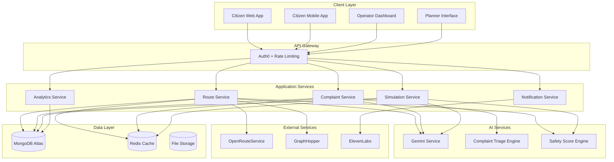

# CivicSafe AI Design Document

## Overview

CivicSafe AI is a comprehensive smart city safety platform that integrates intelligent routing, AI-powered complaint management, and safety simulation tools into a unified ecosystem. The system serves three distinct user personas through specialized interfaces while maintaining a shared data foundation and AI-powered insights engine.

### Core Value Proposition

The platform transforms how cities approach safety by combining real-time crowdsourced data, historical incident analysis, and AI-powered decision support. Citizens receive personalized safety guidance, operators gain intelligent triage capabilities, and planners access predictive simulation tools for evidence-based infrastructure decisions.

### System Boundaries

**In Scope:**
- Multi-tenant web and mobile applications for three user types
- AI-powered route calculation with safety scoring
- Intelligent complaint classification and triage
- Safety impact simulation and what-if analysis
- Real-time data processing and visualization
- Integration with external routing and AI services

**Out of Scope:**
- Emergency dispatch system integration
- Direct law enforcement coordination
- Physical infrastructure monitoring sensors
- Payment processing for city services
- Multi-language localization (English only for MVP)

## Architecture

### High-Level Architecture

The system follows a microservices architecture with clear separation between user-facing applications, business logic services, and data management layers. This design supports independent scaling, deployment, and maintenance of different system components.



### Technology Stack

**Frontend Technologies:**
- React 18 with TypeScript for web applications
- React Native for mobile applications
- Mapbox GL JS for interactive mapping
- Material-UI for consistent design system
- PWA capabilities for offline functionality

**Backend Technologies:**
- Node.js 18+ with Express.js framework
- TypeScript for type safety
- JWT tokens for stateless authentication
- WebSocket connections for real-time updates
- Docker containers for deployment

**Data Storage:**
- MongoDB Atlas for primary data storage
- Redis for caching and session management
- GridFS for file storage (images, audio)
- Geospatial indexing for location queries

**External Integrations:**
- Auth0 for authentication and user management
- Gemini AI for natural language processing
- OpenRouteService/GraphHopper for routing
- ElevenLabs for voice synthesis (optional)
- Vultr for cloud infrastructure

### Deployment Architecture

The system deploys on Vultr cloud infrastructure using containerized microservices with horizontal scaling capabilities.

```mermaid
graph TB
    subgraph "Load Balancer"
        LB[Vultr Load Balancer]
    end
    
    subgraph "Application Tier"
        AS1[App Server 1]
        AS2[App Server 2]
        AS3[App Server N]
    end
    
    subgraph "Cache Tier"
        RC1[Redis Primary]
        RC2[Redis Replica]
    end
    
    subgraph "Database Tier"
        MDB[MongoDB Atlas Cluster]
    end
    
    subgraph "CDN"
        CDN[Static Assets]
    end
    
    LB --> AS1
    LB --> AS2
    LB --> AS3
    
    AS1 --> RC1
    AS2 --> RC1
    AS3 --> RC1
    
    RC1 --> RC2
    
    AS1 --> MDB
    AS2 --> MDB
    AS3 --> MDB
    
    CDN --> LB
```

## Components and Interfaces

### Safe Router Service

The Safe Router Service calculates optimal routes by combining external routing APIs with internal safety scoring algorithms.

**Core Responsibilities:**
- Route calculation using external APIs
- Safety score computation and caching
- Route profile generation
- Real-time safety updates

**Key Interfaces:**

```typescript
interface RouteRequest {
  origin: GeoPoint;
  destination: GeoPoint;
  preferences: RoutePreferences;
  userId?: string;
}

interface RouteResponse {
  routes: Route[];
  explanations: RouteExplanation[];
  calculationTime: number;
}

interface Route {
  id: string;
  segments: RouteSegment[];
  totalDistance: number;
  estimatedTime: number;
  safetyScore: number;
  routeType: 'fastest' | 'safest';
}

interface RouteSegment {
  coordinates: GeoPoint[];
  safetyScore: number;
  safetyFactors: SafetyFactor[];
  distance: number;
  estimatedTime: number;
}
```

**Safety Scoring Algorithm:**

The safety scoring combines multiple data sources with weighted factors:

1. **Historical Incidents (40% weight):** Crime reports, accidents, emergency calls
2. **Infrastructure Quality (25% weight):** Lighting, sidewalks, crosswalks
3. **Crowdsourced Reports (20% weight):** Recent user safety reports
4. **Environmental Factors (15% weight):** Time of day, weather, events

### Complaint Triage Engine

The Complaint Triage Engine uses AI to automatically classify and prioritize citizen complaints for efficient operator response.

**Core Responsibilities:**
- Natural language processing of complaint text
- Automatic classification into predefined categories
- Urgency level assignment
- Confidence scoring for manual review flagging

**Key Interfaces:**

```typescript
interface ComplaintSubmission {
  text: string;
  location: GeoPoint;
  photos?: string[];
  audioNote?: string;
  submitterId: string;
  timestamp: Date;
}

interface TriageResult {
  complaintId: string;
  category: ComplaintCategory;
  urgencyLevel: UrgencyLevel;
  confidence: number;
  reasoning: string;
  suggestedDepartment: string;
  estimatedResponseTime: number;
}

enum ComplaintCategory {
  LIGHTING = 'lighting',
  INFRASTRUCTURE = 'infrastructure',
  TRAFFIC = 'traffic',
  CRIME = 'crime',
  MAINTENANCE = 'maintenance',
  OTHER = 'other'
}

enum UrgencyLevel {
  LOW = 'low',
  MEDIUM = 'medium',
  HIGH = 'high',
  CRITICAL = 'critical'
}
```

**Classification Algorithm:**

The AI classification process follows these steps:

1. **Text Preprocessing:** Clean and normalize complaint text
2. **Feature Extraction:** Extract keywords, sentiment, and context
3. **Location Context:** Consider area-specific factors and history
4. **Category Classification:** Use trained model for category assignment
5. **Urgency Assessment:** Evaluate severity based on content and location
6. **Confidence Scoring:** Calculate reliability of classification

### Safety Simulator

The Safety Simulator provides urban planners with tools to model the safety impact of infrastructure changes.

**Core Responsibilities:**
- Infrastructure scenario modeling
- Safety impact prediction
- Cost-benefit analysis
- Comparative scenario evaluation

**Key Interfaces:**

```typescript
interface SimulationScenario {
  id: string;
  name: string;
  description: string;
  infrastructureChanges: InfrastructureChange[];
  baselineDate: Date;
  createdBy: string;
}

interface InfrastructureChange {
  type: InfrastructureType;
  location: GeoPoint | GeoArea;
  action: 'add' | 'remove' | 'modify';
  specifications: Record<string, any>;
  estimatedCost: number;
}

interface SimulationResult {
  scenarioId: string;
  safetyImpact: SafetyImpactMetrics;
  costAnalysis: CostAnalysis;
  riskAssessment: RiskAssessment;
  recommendations: string[];
}

interface SafetyImpactMetrics {
  overallSafetyChange: number;
  affectedAreas: GeoArea[];
  predictedComplaintChange: number;
  incidentReductionEstimate: number;
}
```

### User Interface Components

**Citizen Mobile App:**
- Interactive map with route visualization
- Quick safety reporting interface
- Complaint submission with media upload
- Offline functionality for basic features
- Voice navigation and accessibility support

**Operator Dashboard:**
- Real-time complaint management interface
- Safety heatmap visualization
- AI triage results with confidence indicators
- Department assignment and workflow tools
- Daily summary reports and analytics

**Planner Interface:**
- Infrastructure simulation workspace
- Scenario comparison tools
- Cost-benefit analysis dashboards
- Export capabilities for reports
- Collaborative planning features

## Data Models

### Core Entity Models

**User Model:**
```typescript
interface User {
  id: string;
  auth0Id: string;
  email: string;
  role: UserRole;
  profile: UserProfile;
  preferences: UserPreferences;
  createdAt: Date;
  lastActive: Date;
  isActive: boolean;
}

enum UserRole {
  CITIZEN = 'citizen',
  OPERATOR = 'operator',
  PLANNER = 'planner',
  ADMIN = 'admin'
}

interface UserProfile {
  firstName?: string;
  lastName?: string;
  department?: string; // For operators and planners
  phoneNumber?: string;
  accessibilityNeeds?: AccessibilityOptions[];
}
```

**Safety Segment Model:**
```typescript
interface SafetySegment {
  id: string;
  geometry: GeoLineString;
  safetyScore: number;
  lastUpdated: Date;
  factors: SafetyFactor[];
  historicalData: HistoricalSafetyData[];
  crowdsourcedReports: string[]; // References to reports
}

interface SafetyFactor {
  type: SafetyFactorType;
  value: number;
  weight: number;
  source: DataSource;
  lastUpdated: Date;
}

enum SafetyFactorType {
  LIGHTING = 'lighting',
  FOOT_TRAFFIC = 'foot_traffic',
  CRIME_HISTORY = 'crime_history',
  INFRASTRUCTURE = 'infrastructure',
  EMERGENCY_ACCESS = 'emergency_access'
}
```

**Complaint Model:**
```typescript
interface Complaint {
  id: string;
  submitterId: string;
  text: string;
  location: GeoPoint;
  address: string;
  category: ComplaintCategory;
  urgencyLevel: UrgencyLevel;
  status: ComplaintStatus;
  assignedDepartment?: string;
  assignedOperator?: string;
  aiClassification: AIClassificationResult;
  attachments: Attachment[];
  timeline: ComplaintTimelineEntry[];
  createdAt: Date;
  updatedAt: Date;
}

interface AIClassificationResult {
  category: ComplaintCategory;
  urgencyLevel: UrgencyLevel;
  confidence: number;
  reasoning: string;
  suggestedDepartment: string;
  processingTime: number;
}

enum ComplaintStatus {
  SUBMITTED = 'submitted',
  TRIAGED = 'triaged',
  ASSIGNED = 'assigned',
  IN_PROGRESS = 'in_progress',
  RESOLVED = 'resolved',
  CLOSED = 'closed'
}
```

**Route Model:**
```typescript
interface Route {
  id: string;
  userId?: string;
  origin: GeoPoint;
  destination: GeoPoint;
  segments: RouteSegment[];
  totalDistance: number;
  estimatedTime: number;
  safetyScore: number;
  routeType: RouteType;
  explanation: string;
  createdAt: Date;
  expiresAt: Date;
}

interface RouteSegment {
  id: string;
  coordinates: GeoPoint[];
  safetyScore: number;
  distance: number;
  estimatedTime: number;
  safetyFactors: SafetyFactor[];
  warnings: SafetyWarning[];
}

enum RouteType {
  FASTEST = 'fastest',
  SAFEST = 'safest',
  BALANCED = 'balanced'
}
```

### Geospatial Data Structures

**GeoPoint:**
```typescript
interface GeoPoint {
  type: 'Point';
  coordinates: [number, number]; // [longitude, latitude]
}
```

**GeoArea:**
```typescript
interface GeoArea {
  type: 'Polygon';
  coordinates: number[][][]; // GeoJSON polygon format
}
```

**GeoLineString:**
```typescript
interface GeoLineString {
  type: 'LineString';
  coordinates: number[][]; // Array of [longitude, latitude] pairs
}
```

### Database Indexing Strategy

**MongoDB Collections and Indexes:**

1. **users**: Compound index on (auth0Id, role), single index on email
2. **complaints**: Geospatial index on location, compound index on (status, urgencyLevel, createdAt)
3. **safetySegments**: Geospatial index on geometry, single index on lastUpdated
4. **routes**: TTL index on expiresAt, compound index on (userId, createdAt)
5. **reports**: Geospatial index on location, compound index on (submitterId, createdAt)

**Cache Strategy:**
- Route calculations cached for 15 minutes
- Safety scores cached for 5 minutes
- User sessions cached for 8 hours
- Static data (infrastructure) cached for 24 hours

## Correctness Properties

*A property is a characteristic or behavior that should hold true across all valid executions of a system-essentially, a formal statement about what the system should do. Properties serve as the bridge between human-readable specifications and machine-verifiable correctness guarantees.*

### Property 1: Route Generation Completeness

*For any* valid origin and destination coordinates, the Safe_Router should generate both fastest and safest route options, with each route containing properly scored segments and appropriate color coding based on safety levels.

**Validates: Requirements 1.1, 1.2, 1.3, 1.4**

### Property 2: Route Explanation Generation

*For any* generated route, the Gemini_AI should produce explanations that reference specific safety factors and include appropriate warnings for routes passing through lower safety areas.

**Validates: Requirements 2.1, 2.2, 2.3**

### Property 3: Safety Report Data Capture

*For any* safety report submission, the system should automatically capture location data and support attachment of photos and voice notes while validating report authenticity.

**Validates: Requirements 3.2, 3.3, 3.5**

### Property 4: Complaint Data Completeness

*For any* complaint submission, the system should capture all required fields (text, location, photos, timestamp) and return a confirmation with tracking number.

**Validates: Requirements 4.1, 4.5**

### Property 5: Complaint Classification Validity

*For any* complaint processed by the triage engine, the system should assign valid urgency levels with confidence scores in the range 0-100, and flag critical safety complaints appropriately.

**Validates: Requirements 4.3, 4.4, 5.3, 5.4**

### Property 6: NLP Processing Consistency

*For any* complaint text, the triage engine should process it through natural language processing and incorporate location-specific factors in classification decisions.

**Validates: Requirements 5.1, 5.2**

### Property 7: Priority Update Propagation

*For any* complaint with new information, the triage engine should re-evaluate and update priorities as context changes.

**Validates: Requirements 5.5**

### Property 8: Complaint Display Ordering

*For any* set of active complaints, the operator dashboard should display them correctly sorted by urgency level and creation time.

**Validates: Requirements 6.1**

### Property 9: Complaint Detail Completeness

*For any* complaint viewed by an operator, the system should display all required information including details, map location, and AI classification reasoning.

**Validates: Requirements 6.2**

### Property 10: Operator Update Functionality

*For any* complaint, operators should be able to update status, assign to departments, and add response notes with changes properly persisted.

**Validates: Requirements 6.3**

### Property 11: Heatmap Data Accuracy

*For any* generated safety heatmap, the visualization should correctly represent complaint density and safety scores across city areas, highlighting hotspots when patterns emerge.

**Validates: Requirements 6.4, 6.5**

### Property 12: Daily Summary Content Completeness

*For any* daily safety summary, the AI should include analysis of complaint trends, safety score changes, correlations with external factors, actionable recommendations, and highlight critical issues when present.

**Validates: Requirements 7.1, 7.2, 7.3, 7.5**

### Property 13: Simulation Response to Changes

*For any* infrastructure modification in the safety simulator, the system should recalculate safety scores for affected areas, predict complaint volume changes, and generate before/after comparison data.

**Validates: Requirements 8.3, 8.4, 8.5**

### Property 14: Scenario Management Functionality

*For any* infrastructure scenario, planners should be able to save it with a name, compare multiple scenarios with safety and cost metrics, rank scenarios by cost-effectiveness, export comparisons, and validate feasibility.

**Validates: Requirements 9.1, 9.2, 9.3, 9.4, 9.5**

### Property 15: Authentication and Authorization

*For any* user authentication attempt, the system should accept valid Auth0 credentials, enforce role-based permissions, and redirect unauthorized access attempts appropriately while logging actions with PII protection.

**Validates: Requirements 10.1, 10.2, 10.3, 10.5**

### Property 16: Critical Incident Notification

*For any* safety report classified as critical, the system should immediately trigger notifications to relevant operators.

**Validates: Requirements 11.3**

### Property 17: API Data Export Functionality

*For any* complaint data export request, the REST API should return data in the expected format for integration with city management systems.

**Validates: Requirements 12.1**

### Property 18: External Data Validation

*For any* external data source integration, the system should validate data quality and flag inconsistencies appropriately.

**Validates: Requirements 12.3**

### Property 19: Webhook Event Triggering

*For any* appropriate system event, webhook notifications should be triggered for real-time data sharing with partner systems.

**Validates: Requirements 12.4**

### Property 20: API Rate Limiting

*For any* API request sequence, rate limiting should be enforced to prevent system overload while maintaining responsive service.

**Validates: Requirements 12.5**

### Property 21: Offline Functionality

*For any* basic route viewing and complaint drafting operation, the system should function without network connectivity and synchronize actions when connectivity is restored.

**Validates: Requirements 13.2, 13.3**

### Property 22: Data Encryption and Anonymization

*For any* user location data, the system should encrypt it using AES-256 both in transit and at rest, and anonymize crowdsourced reports while preserving location accuracy.

**Validates: Requirements 14.1, 14.2**

### Property 23: User Data Control

*For any* user account, the system should provide functional data export and deletion controls through account settings.

**Validates: Requirements 14.5**

### Property 24: Accessibility Feature Availability

*For any* user interface, the system should support screen readers, provide high contrast mode and adjustable fonts, offer voice-to-text input, and include audio guidance with safety warnings.

**Validates: Requirements 15.1, 15.2, 15.3, 15.4**

## Error Handling

### Error Classification and Response Strategy

The system implements a comprehensive error handling strategy that categorizes errors by severity and provides appropriate user feedback while maintaining system stability.

**Error Categories:**

1. **User Input Errors (4xx level)**
   - Invalid coordinates or addresses
   - Malformed complaint submissions
   - Authentication failures
   - Rate limit violations

2. **System Errors (5xx level)**
   - External API failures (routing services, Gemini AI)
   - Database connectivity issues
   - Cache service unavailability
   - File storage problems

3. **Business Logic Errors**
   - Safety score calculation failures
   - Route generation timeouts
   - Classification confidence below thresholds
   - Simulation constraint violations

**Error Response Patterns:**

```typescript
interface ErrorResponse {
  error: {
    code: string;
    message: string;
    details?: Record<string, any>;
    timestamp: Date;
    requestId: string;
  };
  fallback?: any; // Graceful degradation data
}
```

**Graceful Degradation Strategies:**

- **Route Calculation Failures:** Fall back to cached routes or basic distance-based routing
- **AI Service Unavailability:** Use rule-based classification with manual review flagging
- **Database Connectivity Issues:** Serve cached data with staleness indicators
- **External API Failures:** Use alternative routing providers or cached route data

**Error Monitoring and Alerting:**

- Real-time error tracking with severity-based alerting
- Performance degradation detection and automatic scaling
- User experience impact monitoring with rollback capabilities
- Comprehensive logging with correlation IDs for debugging

### Retry and Circuit Breaker Patterns

**Exponential Backoff Retry:**
- External API calls: 3 retries with exponential backoff
- Database operations: 2 retries with linear backoff
- File uploads: 5 retries with exponential backoff

**Circuit Breaker Implementation:**
- AI service calls: 50% failure rate threshold, 30-second timeout
- External routing APIs: 60% failure rate threshold, 60-second timeout
- Database connections: 70% failure rate threshold, 10-second timeout

## Testing Strategy

### Dual Testing Approach

The CivicSafe AI platform employs a comprehensive testing strategy that combines unit testing for specific scenarios with property-based testing for universal correctness guarantees.

**Unit Testing Focus Areas:**
- Specific user interaction flows and edge cases
- Integration points between services
- Error conditions and boundary cases
- Authentication and authorization workflows
- API endpoint functionality with mock data

**Property-Based Testing Focus Areas:**
- Universal properties that must hold across all inputs
- Data transformation and validation logic
- Safety scoring algorithms with randomized inputs
- Route calculation correctness across coordinate ranges
- Complaint classification accuracy with varied text inputs

### Property-Based Testing Configuration

**Testing Framework:** fast-check for JavaScript/TypeScript property-based testing

**Test Configuration Requirements:**
- Minimum 100 iterations per property test to ensure comprehensive input coverage
- Each property test must reference its corresponding design document property
- Tag format: **Feature: civic-safe-ai, Property {number}: {property_text}**
- Randomized test data generators for coordinates, complaint text, user profiles, and infrastructure scenarios

**Example Property Test Structure:**

```typescript
// Feature: civic-safe-ai, Property 1: Route Generation Completeness
test('Route generation produces both fastest and safest options', () => {
  fc.assert(fc.property(
    fc.record({
      origin: coordinateGenerator,
      destination: coordinateGenerator
    }),
    async (routeRequest) => {
      const result = await routeService.calculateRoutes(routeRequest);
      
      expect(result.routes).toHaveLength(2);
      expect(result.routes.some(r => r.routeType === 'fastest')).toBe(true);
      expect(result.routes.some(r => r.routeType === 'safest')).toBe(true);
      
      result.routes.forEach(route => {
        expect(route.segments.every(s => 
          s.safetyScore >= 0 && s.safetyScore <= 100
        )).toBe(true);
      });
    }
  ), { numRuns: 100 });
});
```

**Data Generators:**

```typescript
const coordinateGenerator = fc.record({
  latitude: fc.float({ min: -90, max: 90 }),
  longitude: fc.float({ min: -180, max: 180 })
});

const complaintTextGenerator = fc.string({ 
  minLength: 10, 
  maxLength: 500 
});

const userRoleGenerator = fc.constantFrom(
  'citizen', 'operator', 'planner', 'admin'
);
```

### Integration Testing Strategy

**Service Integration Tests:**
- End-to-end route calculation with external APIs
- Complaint submission and triage workflow
- Real-time notification delivery
- Data synchronization between services

**External Service Mocking:**
- Gemini AI responses for consistent testing
- Routing service APIs with predictable results
- Auth0 authentication flows
- File storage operations

**Performance Testing:**
- Load testing with 10,000 concurrent users
- Route calculation performance under load
- Database query optimization validation
- Cache effectiveness measurement

### Accessibility Testing

**Automated Accessibility Testing:**
- axe-core integration for WCAG 2.1 AA compliance
- Screen reader compatibility testing
- Keyboard navigation validation
- Color contrast verification

**Manual Accessibility Testing:**
- User testing with assistive technologies
- Voice navigation workflow validation
- High contrast mode usability testing
- Font size adjustment functionality

### Security Testing

**Authentication and Authorization Testing:**
- Role-based access control validation
- JWT token security and expiration
- Session management and timeout testing
- API endpoint security verification

**Data Protection Testing:**
- Encryption validation for data at rest and in transit
- PII anonymization verification
- Data export and deletion functionality
- GDPR compliance validation

### Continuous Integration Pipeline

**Automated Test Execution:**
- Unit tests on every commit
- Property-based tests on pull requests
- Integration tests on staging deployment
- Performance tests on release candidates

**Quality Gates:**
- 90% code coverage requirement
- All property tests must pass
- No critical security vulnerabilities
- Performance benchmarks must be met

**Test Environment Management:**
- Isolated test databases for each test suite
- Mock external services for consistent results
- Automated test data generation and cleanup
- Parallel test execution for faster feedback